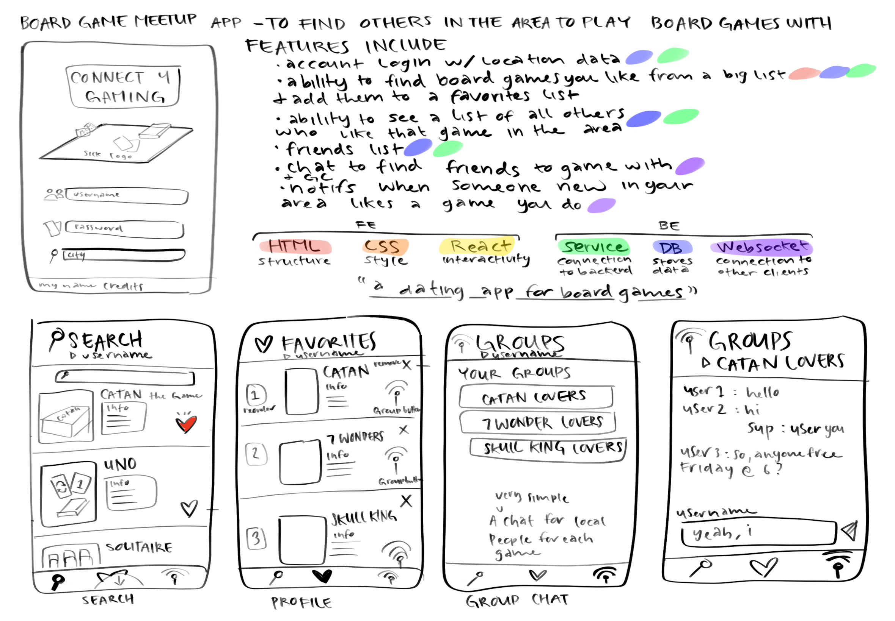

# Connect 4 Gaming

[My Notes](notes.md)

This application allows people to curate lists of their favorite board games and connect with other people in their area that like the same games. This application helps people wanting to play a certain board game find and create a local group to play together.

## 🚀 Specification Deliverable

For this deliverable I did the following.

- [x] Proper use of Markdown
- [x] A concise and compelling elevator pitch
- [x] Description of key features
- [x] Description of how you will use each technology
- [x] One or more rough sketches of your application. Images must be embedded in this file using Markdown image references.

### Elevator pitch

Connect 4 Gaming is like a dating app for people who want to play board games. You can add board games to your favorites list and find other people in the local area who share your interests. This application will set you up on board game dates with others, helping you meet and make new lifelong friends.

### Design

There will be 6 pages to this application. A home page to log in, a search page to browse a list of board games, a favorites page to view and edit your favorite board game list, and a groups page where you can join chats with other nearby users who enjoy the same games you do. The chats page will be connected to the groups page. An about page will also exist found at the bottom of the home login page, though not pictured in this diagram. Ignore the list of features - some have been added or removed since the initial concept idea.

### Key features

- Account login, logout, and register with location data
- Search a catalog of board games and add them to a personal favorites list
- Edit and reorder a board game favorite list
- Chat with other users from the local area who enjoy the same board games
- See a description of the app and creator

### Technologies

I am going to use the required technologies in the following ways.

- **HTML** - 6 different pages, login/register controls, images for board games and description page
- **CSS** - A nice looking style with a gruvbox color scheme and many symbolic buttons for navigation
- **React** - A Single page application with routing and state hooks in order to make the website run more responsively
- **Service** - Endpoints for login and logout, third party call to get geolocation and place databases (maybe a database of all board games as well), store/retrieve favorites, location
- **DB/Login** - Stores login information, location, chat history, and favorites
- **WebSocket** - Enables chat funtions between users and notifications when messages are sent

## 🚀 AWS deliverable

For this deliverable I did the following.

- [x] **Server deployed and accessible with custom domain name** - [My server link](https://seven-wonders.click).

## 🚀 HTML deliverable

For this deliverable I did the following.

- [x] **HTML pages** - I added 5 different pages: index.html, search.html, favorites.html, groups.html, and about.html
- [x] **Proper HTML element usage** - I added several different elements. hrefs, p, tables, forms
- [x] **Links** - I linked to my github page and also got images from the internet
- [x] **Text** - There's plenty of text on each page
- [x] **3rd party API placeholder** - I mentioned how this will happen on my index.html page and utilized on groups.html. I also might try to get my board game database from a 3rd party API
- [x] **Images** - I took plenty of images from the internet and also the pfp 2 image in this repository
- [x] **Login placeholder** - My index.html page has a login placeholder and the username display is at the top of each page.
- [x] **DB data placeholder** - DB will store login information, favorites for each user, and locations
- [x] **WebSocket placeholder** - I mentioned on groups.html how the websocket will come into play. I changed my original plan a little bit.

## 🚀 CSS deliverable

For this deliverable I did the following.

- [x] **Visually appealing colors and layout. No overflowing elements.** - It think it looks pretty good!
- [x] **Use of a CSS framework** - I used plenty of CSS everywhere. It might be a bit of a mess...
- [x] **All visual elements styled using CSS** - Everything's styled!
- [x] **Responsive to window resizing using flexbox and/or grid display** - I'm pretty sure it looks good with all sizes of viewport. Checked it on my pc and mobil phone.
- [x] **Use of a imported font** - I downloaded Buttons and used that. I was struggling to get literally ANY other font working...
- [x] **Use of different types of selectors including element, class, ID, and pseudo selectors** - I used all types of selectors. Some more than others, but I used it all

## 🚀 React part 1: Routing deliverable

For this deliverable I did the following. I checked the box `[x]` and added a description for things I completed.

- [ ] **Bundled using Vite** - I did not complete this part of the deliverable.
- [ ] **Components** - I did not complete this part of the deliverable.
- [ ] **Router** - I did not complete this part of the deliverable.

## 🚀 React part 2: Reactivity deliverable

For this deliverable I did the following. I checked the box `[x]` and added a description for things I completed.

- [ ] **All functionality implemented or mocked out** - I did not complete this part of the deliverable.
- [ ] **Hooks** - I did not complete this part of the deliverable.

## 🚀 Service deliverable

For this deliverable I did the following. I checked the box `[x]` and added a description for things I completed.

- [ ] **Node.js/Express HTTP service** - I did not complete this part of the deliverable.
- [ ] **Static middleware for frontend** - I did not complete this part of the deliverable.
- [ ] **Calls to third party endpoints** - I did not complete this part of the deliverable.
- [ ] **Backend service endpoints** - I did not complete this part of the deliverable.
- [ ] **Frontend calls service endpoints** - I did not complete this part of the deliverable.
- [ ] **Supports registration, login, logout, and restricted endpoint** - I did not complete this part of the deliverable.

## 🚀 DB deliverable

For this deliverable I did the following. I checked the box `[x]` and added a description for things I completed.

- [ ] **Stores data in MongoDB** - I did not complete this part of the deliverable.
- [ ] **Stores credentials in MongoDB** - I did not complete this part of the deliverable.

## 🚀 WebSocket deliverable

For this deliverable I did the following. I checked the box `[x]` and added a description for things I completed.

- [ ] **Backend listens for WebSocket connection** - I did not complete this part of the deliverable.
- [ ] **Frontend makes WebSocket connection** - I did not complete this part of the deliverable.
- [ ] **Data sent over WebSocket connection** - I did not complete this part of the deliverable.
- [ ] **WebSocket data displayed** - I did not complete this part of the deliverable.
- [ ] **Application is fully functional** - I did not complete this part of the deliverable.
